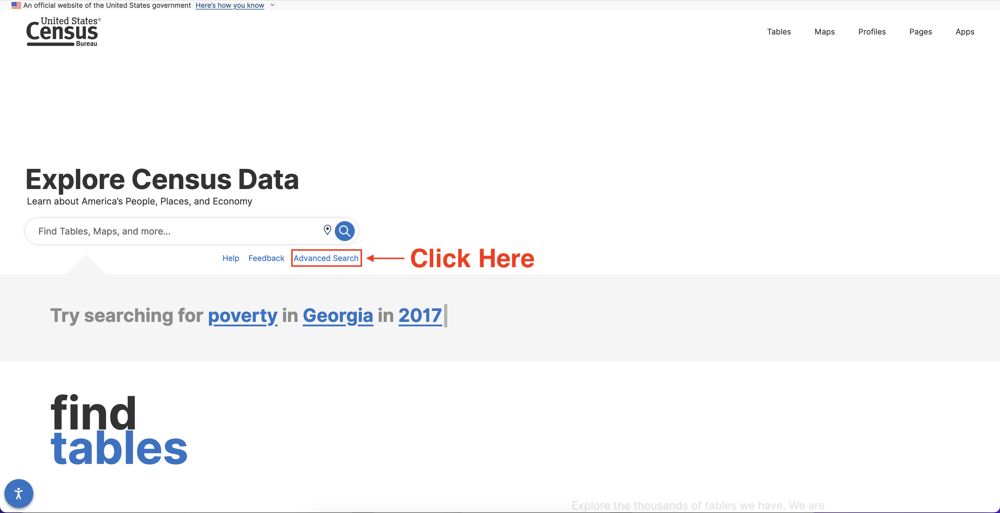
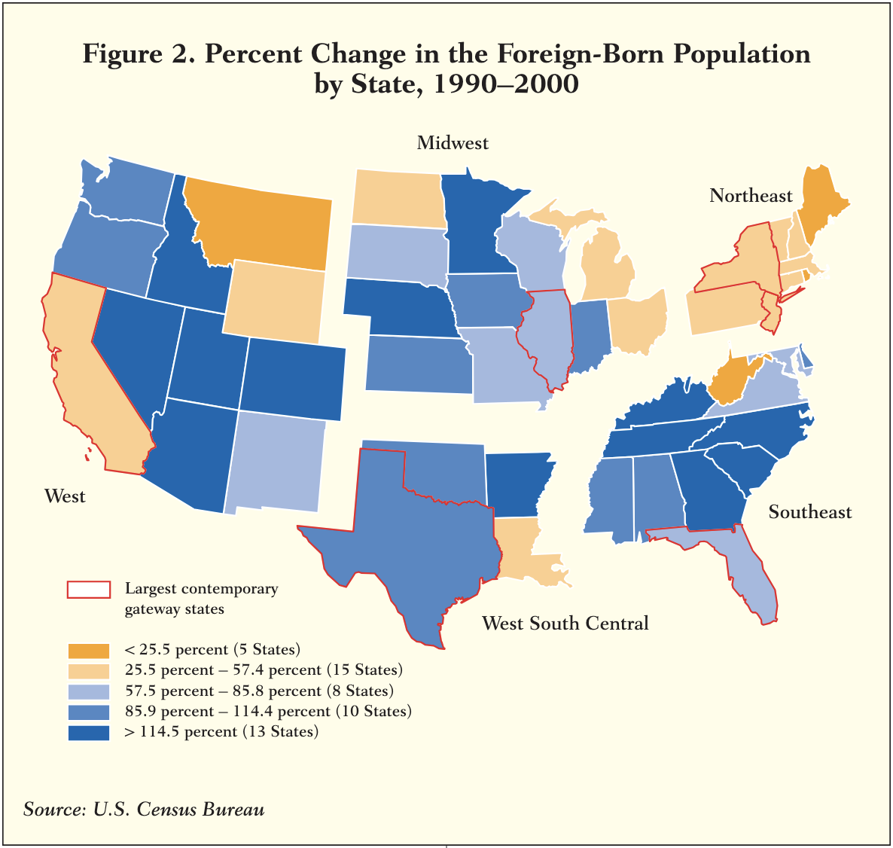

```{r setup, include=FALSE}
knitr::opts_chunk$set(echo = TRUE)
```

# Learning Objectives

Welcome to Census Data Analysis and Mapping in R! Our goals for today's workshop are:

1.  Understand the basic features of census data and learn how to navigate the interface of the [data.census.gov](data.census.gov) website
2.  Learn how to use the `tidycensus` package to quickly download data from the Census API using the functions `get_decennial()`, `get_acs()`, and `get_pums()`
3.  Produce data visualizations and explore real-world research questions using census data

------------------------------------------------------------------------

Throughout this workshop series, we will use the following icons:

**🔔 Question:** A quick question to help you understand what's going on.

**🥊 Challenge:** Interactive exercise. We'll go through these in the workshop!

**⚠️ Warning:** Heads-up about tricky stuff or common mistakes.

**💡 Tip:** How to do something a bit more efficiently or effectively.

**📝 Poll:** A zoom poll to help you learn.

**🎬 Demo:** Showing off something more advanced so you know what you can use R for in the future.

------------------------------------------------------------------------

# Part 1: Introducing U.S. Census Data

## 1.1 Why Census Data?

The U.S. Census Bureau is the "nation's leading provider of quality data about its people and economy". U.S. Census data contains a variety of information about the demographic, social, and economic characteristics of the U.S. population, as well as the physical and economic characteristics of housing.

| Demographic   | Social            | Economic          | Housing           |
|---------------|-------------------|-------------------|-------------------|
| Sex           | Families          | Income            | Tenure            |
| Age           | Education         | Benefits          | Occupancy         |
| Race\*        | Marital Status    | Employment Status | Group Quarters    |
| Ethnicity\*   | Fertility         | Occupation        | Housing Value     |
| Relationships | Grandparents      | Industry          | Taxes & Insurance |
|               | Veterans          | Commuting         | Utilities         |
|               | Disability Status | Place of Work     | Mortgage          |
|               | Language at Home  | Health Insurance  | Monthly Rent      |
|               | Citizenship       |                   | Structure Type    |
|               | Mobility          |                   |                   |

**\***The U.S. Census maintains separate definitions of **Race** ("White", "Black or African American", "Asian", etc.), and **Ethnicity** (whether someone identifies as "Hispanic or Latino").

Census data can be used to answer research questions across a variety of disciplines:

-   **Political Science:** What are the demographic characteristics of congressional districts that elected a Republican in the last election?

-   **Economics:** How have patterns of employment changed in response to specific changes in state laws (e.g. minimum wage increases)?

-   **Sociology:** To what extent is the population of a particular city segregated by race?

-   **Public Health:** What are the demographic characteristics of neighborhoods located by local sources of pollution?

-   **Urban Planning:** What is the average commuting time for workers in different regions?

**🔔 Question:** What other examples can you think of from your [own]{.ul} discipline based on the variables listed above? Are there any questions that you would be interested in answering with census data?

## 1.2 Census Data Formats

There are two primary public data sources provided by the U.S. Census Bureau:

-   **Decennial Census**

    -   Once every 10 years (since 1790!)

    -   Complete count of U.S. population and housing, including basic characteristics such as sex, age, race/ethnicity, family structure, vacancy, and housing tenure (owning vs. renting)

    -   Between 1840 and 2000, also asked more detailed demographic/economic questions of a `sample` of the population

-   **American Community Survey (ACS)**

    -   Annual survey of 3.5 million randomly sampled households since 2005, asking detailed demographic/economic questions of a sample of the population

    -   Because survey results are based on a sample, each estimate has a margin of error

    -   Two primary data products:

        -   **ACS 1-Year Estimates:** data from a sample of the population collected for a single year[,]{.ul} useful when you want the most current data for areas with larger populations

        -   **ACS 5-Year Estimates:** data from 5 years of data pooled together, useful when you want [smaller margins of error]{.ul}, or [estimates for smaller geographic units]{.ul}

**⚠️ Warning:** ACS data only provides *estimates*. Always pay close attention to the size of the margin of error, particularly for smaller areas and/or smaller populations.

## 1.3 Census Tabulation Units

Census data is collected from individuals. The individual-level responses are called `microdata`. The use of microdata is limited due to privacy concerns. Most census data are made publicly available only when aggregated to larger geographic "tabulation units".

-   Some of these are real administrative units like states and counties.
-   Others are statistical units created by the census, like census tracts and block groups.

Tabulation units are generally nested: counties are nested within states, census tracts are nested within counties, etc. The primary hierarchy of nested units is highlighted below in red. There are also other geographic scales that align with political or administrative geographies, including "Places" (cities, towns, and unincorporated areas), and Congressional Districts. These tabulation units are highlighted in blue.


## 1.4 [data.census.gov](data.census.gov)

You can always download census data by going to the U.S. Census Bureau's purpose-built data interface, [data.census.gov](data.census.gov). This interface can be useful for exploring what census data are available, but is also fairly clunky and makes it difficult to download data in the optimal format for analysis.

Let's take a few minutes to do a live demo of the interface! You are encouraged to follow along either by going to the website, and you can also check out the slides in the file `lessons/data_census_gov.pdf`.



# Part 2: Introducing [`tidycensus`](https://walker-data.com/tidycensus/)

In this tutorial, we will work through several exercises using the [`tidycensus`](https://walker-data.com/tidycensus/index.html) R package to fetch, wrangle, and map census data.

This R package was developed by [Kyle Walker](https://walkerke.github.io/) to make it easier to fetch data from the Census API (we'll explain that more in a second!).

The key `tidycensus` functions we will use today are:

-   `census_api_key()`: makes your Census API key available to tidycensus

-   `load_variables()`: retrieves a dataframe of available census data variables

-   `get_decennial()`: fetches census data from a recent decennial censuses (2000, 2010, and 2020)

-   `get_acs()`: fetches census data from American Community Survey 1-year estimates (beginning with 2005) or 5-year estimates (beginning with 2009)

-   `get_pums()`: fetches census microdata from American Community Survey 1-year estimates (beginning with 2005) or 5-year estimates (beginning with 2009)

## 2.1 Installing Packages

Let's start by installing the packages we'll need! If there are any of these packages that you haven't installed yet.

```{r}
## Install and load package management package
install.packages("pacman")
library(pacman)

## Load and/or install necessary packages
p_load(tidyverse,  ## Data wrangling
       sf,         ## Spatial data
       tidycensus) ## Interactive mapping
```

## 2.2 Getting a Census API Key

You need a `Census API key` to programmatically fetch census data.

-   Get it here: <https://api.census.gov/data/key_signup.html>

-   The key will be sent to your email and you will need to click to activate it.

*For more info on all available Census APIs see: <https://www.census.gov/data/developers/data-sets.html>*

To use your Census API Key in R:

1.  Copy and paste your Census API key from your email either:

    -   Directly into the R Script (see below)
    -   Into a separate text file

2.  Use the tidycensus function `census_api_key()` to register your API key with `tidycensus`.

```{r, eval=FALSE}

# Option 1: Copy your key directly into the R Script (with quotes around it!)
census_api_key("THE_BIG_LONG_ALPHANUMERIC_API_KEY_YOU_GOT_FROM_CENSUS")

# Option 2: Read from text file
census_api_key(read_lines("census.txt"))
```

## 2.3 Finding Variables with `load_variables()`

For any census dataset, we can use the tidycensus `load_variables` function to fetch all available variables.

This function requires two primary arguments: the `year` of the data, and the `dataset`.

Dataset Options:

-   `sf1`: Decennial Census Summary File 1, featuring total population counts and basic summaries

-   `sf3`: Decennial Census Summary File 3, featuring estimates from decennial samples (year 2000 only)

-   `acs1`, `acs1/profile`, `acs1/subject`: 1-Year ACS Estimates, grouped into three categories:

    -   `acs1`: "detailed" tables

    -   `acs1/profile`: "profile" tables that give overviews of key statistics on topics like economic and housing characteristics

    -   `acs1/subject` "subject" tables that focus on specific areas of interest

-   `acs5`, `acs5/profile`, `acs5/subject`: 5-year ACS Estimates, grouped into those same three categories

**💡 Tip:** As a general rule, the "detailed" tables represented by `acs1` and `acs5` are the default for seeking specific variables. The `profile` and `subject` tables may have useful additional variables, including the *percentage* of the population within particular groups.

```{r}
## Load 2010 Decennial Variables (SF1)
vars2010 <- load_variables(year = 2010, dataset = "sf1")

## Let's use the `View` function to look at the full table
View(vars2010)
```

This table features three columns:

-   `name`: The internal census code for each variable. This is what we'll ultimately use to request variables from the census API!

-   `label`: The name of the variable. These names may use `!!` to separate the names of categories and subcategories (and even sub-subcategories), much like the dropdown arrows from the [data.census.gov](data.census.gov) interface.

-   `concept`: The table that the variable belongs to, which tells us the topic that the variable is referring to.

**⚠️ Warning:** Many variables have similar names (i.e. "Total"). Make sure to check both the `label` and `concept` columns to make sure you're choosing the right one!

## 2.4 Fetching Decennial Census Data with `get_decennial()`

Let's start by looking at the very first variable in our table: total housing units! The name of this variable is `H001001`.

```{r}

## Download state-level decennial census variables
units2010 <- get_decennial(geography = "state",       ## Tabulation Unit
                           variables = "H001001",     ## Variable Name for Total Units
                           year = 2010)               ## Year

## View the output
View(units2010)
```

We successfully loaded the number of housing units by state! But this function lets us do a lot more. For example, we can pass [multiple]{.ul} variable names to the `variables` function argument at the same time. Below we add `H002002` for the number of housing units in urban areas.

**💡 Tip:** We can also use the `variables` argument to [rename]{.ul} our variables so that they are easier to interpret! In the code below, we'll change the name of `H001001` to "total", and the name of `H002002` to "urban".

```{r}

## Download state-level decennial census variables
units2010 <- get_decennial(geography = "state",              ## Tabulation Unit
                        variables = c("total" = "H001001",   ## Total Housing
                                      "urban" = "H002002"),  ## Urban Housing
                        year = 2010)                         ## Year

## View the output
View(units2010)
```

**🔔 Question:** What has changed from the previous version of this table? How is the table storing information for multiple variables?

The `get_decennial` function defaults to a "long" or "tidy" format, which means that we have a single column for all of the values, and another column that tells us the variable that each row is associated with. We can instead request a "wide" format, where each variable gets its own column!

```{r}

## Download state-level decennial census variables
units2010 <- get_decennial(geography = "state",                   ## Tabulation Unit
                             variables = c("total" = "H001001",   ## Total Housing
                                           "urban" = "H002002"),  ## Urban Housing
                             year = 2010,                         ## Year
                             output = "wide")                     ## "Wide" Format 

## View the output
View(units2010)
```

## 2.5 Visualizing Decennial Census Data

We can use the `ggplot2` package to create a horizontal bar chart.

**💡 Tip:** We will only be covering basic uses of `ggplot2` in today's workshop. D-Lab's [R Data Visualization](https://github.com/dlab-berkeley/R-Data-Visualization) workshop is highly recommended for additional information on how to create effective data visualizations in R!

```{r}
ggplot() +                        ## Initialize plot
  geom_col(data = units2010_wide, ## Add data
           aes(x = total,         ## Set x-axis as total housing
               y = NAME))         ## Set y-axis as state name
```

Let's clean up this chart, dividing the number of housing units by 1 million, and sorting the states by number of housing units!

```{r}
ggplot() + 
  geom_col(data = units2010_wide,
           aes(x = total/1000000, ## Units / 1 million
               y = reorder(NAME, total))) + ## Reorganize states by total housing units
  theme_bw() + 
  ggtitle("Housing Units by State (2010)") +
  xlab("Housing Units (in Millions)") +
  ylab("State")
```

Even with these adjustments, this chart is a bit difficult to read and interpret. What if we want to create a map of this data, instead? For this, we need to adjust our data download to include the argument `geometry`:

```{r}
## Download state-level decennial census variables
units2010 <- get_decennial(geography = "state",       ## Tabulation Unit
                           variables = c("total" = "H001001",
                                         "urban" = "H002002"),
                           year = 2010,               ## Year
                           geometry = TRUE,           ## Include Spatial Information
                           output = "wide")           ## "Wide" Format 

## View the output
head(units2010)
```

The `tidycensus` package downloads spatial data as an `sf` ("simple features") object. Note that this data format looks like an ordinary data frame, but has an additional `geometry` column containing a complex object. This column stores information about the shape of the geographic observation represented by each row.

**💡 Tip:** We will only be covering basic principles of geospatial data in R in today's workshop. D-Lab's [R Geospatial Fundamentals](https://github.com/dlab-berkeley/R-Geospatial-Fundamentals) workshop is highly recommended for additional information on how to work with spatial data in R!

Luckily, we can easily create a map of `sf` objects using the `ggplot2` package with the `geom_sf` function. This function does [not]{.ul} require `x` or `y` arguments, because these spatial data are already stored within the `geometry` column. Instead, we simply need to provide the `data` we wish to use, and the `fill` color:

```{r}
ggplot() + 
  geom_sf(data = units2010,
          aes(fill = total))
```

There's a big problem here! The data are showing up, but the continental U.S. is really tiny and squished onto the left-hand side of the map.

**🔔 Question:** Why do you think this is happening?

Luckily, there's a quick fix! We can add the argument `shift_geo`, which will fix the geographic anomalies that come with trying to accurately map out the entirety of the United States in space.

```{r}
## Download state-level decennial census variables
units2010 <- get_decennial(geography = "state",       ## Tabulation Unit
                           variables = c("total" = "H001001",
                                         "urban" = "H002002"),
                           year = 2010,               ## Year
                           geometry = TRUE,           ## Include Spatial Information
                           output = "wide",           ## "Wide" Format 
                           shift_geo = TRUE)          ## Fix Alaska/Hawaii problem

ggplot() + 
  geom_sf(data = units2010,
          aes(fill = total))
```

**💡 Tip:** Adding this argument has not only moved around Alaska and Hawaii: it has also changed the shape of the entire map! The background grid of the original map was straight lines, but now the grid lines are *curved*. This is because the `shift_geo` argument transforms the "coordinate reference system" of our spatial data. See D-Lab's [R Geospatial Fundamentals](https://github.com/dlab-berkeley/R-Geospatial-Fundamentals) workshop for more information about how coordinate systems work and why they are important!

The map above isn't all that interesting -- we already know that California and Texas have large populations! We can combine multiple variables for greater insights. For example, what share of housing units in each state are located in urban areas?

```{r}
## Calculate share of housing units in urban areas
units2010 <- units2010 %>% 
  mutate(pct_urban = urban/total)

## Create new plot using `pct_urban`
ggplot() + 
  geom_sf(data = units2010,
          aes(fill = pct_urban))
```

**🔔 Question:** Which states appear to have the most urban and/or rural housing stock? Do you notice any interesting patterns?

## 2.6 Census Tabulation Units in `tidycensus`

Some of the most common geographic tabulation units and their `tidycensus` function abbreviations are shown below, along with filters that can limit what data are returned. Required filters are in **bold**.

+---------------------------------------------------------------+------------------------+-------------------+
| Geography                                                     | Definition             | Filter(s)         |
+===============================================================+========================+===================+
| "us"                                                          | United States          |                   |
+---------------------------------------------------------------+------------------------+-------------------+
| "metropolitan statistical area/micropolitan statistical area" | Metropolitan Area      |                   |
+---------------------------------------------------------------+------------------------+-------------------+
| "state"                                                       | State (or equivalent)  | state             |
+---------------------------------------------------------------+------------------------+-------------------+
| "county"                                                      | County (or equivalent) | state, county     |
+---------------------------------------------------------------+------------------------+-------------------+
| "place"                                                       | Census place           | state             |
+---------------------------------------------------------------+------------------------+-------------------+
| "tract"                                                       | Census tract           | **state**, county |
+---------------------------------------------------------------+------------------------+-------------------+
| "block group"                                                 | Census block group     | **state**, county |
+---------------------------------------------------------------+------------------------+-------------------+
| "block"                                                       | Census block           | **state, county** |
+---------------------------------------------------------------+------------------------+-------------------+

Almost all of these geographic levels can be called by either `get_acs()` or `get_decennial()`. The exception are census blocks, which are only available in the decennial census.

Let's take a look at the same query for county-level data! The table above tells us that we can include optional arguments for specific states or counties when we're looking at county-level data. Let's focus on counties in California, using a new `state` argument.

```{r}

## Download **county-level** decennial census variables for California
units2010 <- get_decennial(geography = "county",       ## Tabulation Unit
                           variables = c("total" = "H001001",   ## Total Units
                                         "urban" = "H002002"),  ## Urban Units
                           year = 2010,               ## Year
                           state = "CA",
                           geometry = TRUE,           ## Include Spatial Information
                           output = "wide")           ## "Wide" Format 

units2010 <- units2010 %>% 
  mutate(pct_urban = urban/total)

## View the output
View(units2010)
```

If we map out this object, we can see that we now have data for all California counties:

```{r}

ggplot() +
  geom_sf(data = units2010,
          aes(fill = pct_urban))

```

## 2.7 Fetching ACS data with `get_acs()`

So far, we've focused on data from the decennial census. But those data are only released every 10 years, and the most recent census (2020) has data quality concerns due to the impacts of the Covid-19 pandemic. So let's look at the other census data product: the American Community Survey (ACS)!

As before, we can start by looking at the list of possible variables. We'll look at the most recent year of available data (`2022`), and we'll focus on the more stable 5-Year Estimates (`acs5`).

**⚠️ Warning:** Remember that ACS variables are spread across three separate groups: detailed tables (`acs5`), profile tables (`acs5/profile`), and subject tables (`acs5/subject`). You may want to explore all three to find the specific variable(s) you're looking for.

```{r}

vars2022 <- load_variables(year = 2022,
                           dataset = "acs5")

View(vars2022)
```

We've already spent some time looking at the share of housing units that are urban, so let's change our focus to something more interesting: median household income. If we search for "median household income" in the variable table, we can see a full list of variables that contain that term.

If we expand the "concept" column, we can see that the first several variables provide the median household income for specific race groups. If we look down far enough, we can see "Median Household Income in the Past 12 Months (in 2022 Inflation-Adjusted Dollars)" is represented by variable `B19013_001`. We'll use this one!

```{r}

## Download tract-level ACS census variables for Alameda County

mhi2022 <- get_acs(geography = "county",      ## Tabulation Unit
                     variables = "B19013_001",  ## Median Household Income
                     year = 2022,
                     state = "CA")           

View(mhi2022)
```

By default, the `get_acs()` function pulls 5-Year ACS estimates. But what if we want more up-to-date estimates? We can switch to 1-Year ACS estimates by setting the argument `survey` equal to `acs1` (the argument for 5-Year estimates is `acs5`).

```{r}

## Download tract-level ACS census variables for Alameda County

mhi2022 <- get_acs(geography = "county",      ## Tabulation Unit
                   variables = "B19013_001",  ## Median Household Income
                   year = 2022,
                   state = "CA",
                   survey = "acs1")           

View(mhi2022)
```

**⚠️ Warning:** Larger geographies such as states, counties, and places have both 1-Year and 5-Year estimates available. Smaller geographies including tracts and block groups only provide 5-Year estimates due to small sample sizes.

## 2.8 Visualizing ACS data

Let's create a graph of our data! This time, however, we will also include an additional function called `geom_errorbar` so that we can see the "margin of error" surrounding our estimates. This function takes the arguments `xmin` and `xmax` (or `ymin` and `ymax` if the graph is oriented vertically). The bottom of our margin (`xmin`) will be the `estimate` [minus]{.ul} the margin of error (`moe`), and the top of our margin (`xmax`) will be the `estimate` [plus]{.ul} the margin of error.

```{r}
ggplot(data = mhi2022) +
  geom_col(aes(x = estimate,
               y = reorder(NAME, estimate))) +
  geom_errorbar(aes(xmin = estimate - moe,
                    xmax = estimate + moe,
                    y = NAME))
```

This graph isn't super readable because there are so many counties! We can simplify things a bit by focusing on counties with an estimated median household income greater than \$100,000:

```{r}
ggplot(data = med_hhinc %>% filter(estimate > 100000)) +
  geom_col(aes(x = estimate,
               y = reorder(NAME, estimate))) +
  geom_errorbar(aes(xmin = estimate - moe,
                    xmax = estimate + moe,
                    y = NAME))
```

What if we're interested in the spatial distribution of median household incomes for individual neighborhoods? For this, we will use census tracts. Queries involving census tracts require you to specify a state, and include an optional argument for the county or counties you wish to look at. Let's look at Alameda County as an example:

```{r}

mhi2022 <- get_acs(geography = "tract",      ## Tabulation Unit
                   variables = c("medinc" = "B19013_001"),  ## Median Household Income
                   year = 2022,               ## Year
                   state = "CA",              ## State
                   county = "Alameda",        ## County
                   geometry = TRUE)           ## "Wide" Format 

View(mhi2022)
```

Now we can map out our data, using the `geom_sf()` function!

```{r}
ggplot() +
  geom_sf(data = medincE,
          aes(fill = estimate))
```

**🔔 Question:** What spatial patterns do you notice? Which neighborhoods seem to be particularly wealthy (or not)?

## 2.9 Challenges

Let's take what we've learned and use census data to answer a set of research questions!

As we've discussed, there are many different types of research questions that census data can help us answer. For this exercise, we're going to replicate this figure from a 2004 [Brookings Institute report](https://www.brookings.edu/wp-content/uploads/2016/06/20040301_gateways.pdf) about trends in U.S. immigration during the 1990s:



**🔔 Question:** What is this map telling us? What does it mean for a state to be highlighted in dark orange, or dark blue?

## 🥊 Challenge 1: Which states had the largest foreign-born populations in 2010?

Let's take this one step at a time, following the approach we took previously:

1.  First, we need to find the variable we're looking for, using the `load_variables` function

**💡 Tip:** Immigrants are identified within census terminology as "Foreign born", while individuals born in the United States are identified as "Native".

2.  Second, we input that variable into `get_acs` to retrieve our data

```{r}

## Step 1: Find variable(s)
vars <- load_variables(year = ____,
                           dataset = "___")

View(vars)
```

```{r}
## Step 2: Load data for 2019
df2010 <- get_acs(geography = "_____",
                  variables = c("foreign_born_2010" = "__________"),
                  year = ____,
                  output = "____",
                  geometry = ____,
                  survey = "____")
```

```{r}
## Step 3: Visualize data
ggplot() + 
  geom_sf(data = ______,
          aes(fill = _______)) +
  theme_void()
```

**🔔 Question:** Which states appear to have the highest numbers of foreign-born residents?

## 🥊 Challenge 2: Which states have experienced the largest *changes* in foreign-born population between 2010 and 2019?

**⚠️ Warning:** The onset of the Covid-19 pandemic in mid-2020 impacted census data collection. While the census did release a set of experimental estimates, these estimates are potentially unreliable. `tidycensus` returns an explanatory error message if you attempt to request 1-year estimates for 2020.

```{r}
get_acs(year = 2020, survey = "acs1")
```

Instead, let's look just before the pandemic, in 2019.

How did patterns of immigration change over time? We can figure this out by changing the year of our API query and assigning the result to a new object.

```{r}
df2019 <- get_acs(geography = "_____",
                  variables = c("foreign_born_2019" = "__________"),
                  year = ____,
                  output = "____",
                  geometry = ____,
                  survey = "____")         
```

We then need to join the two objects together. There are a few different ways to do this, but we're going to use the `left_join()` function. Next, we need to calculate percentage change to determine the change in the size of the foreign-born population.

```{r}
df2010_2019 <- df2010 %>% left_join(df2019)

df2010_2019 <- df2010_2019 %>%
  mutate(foreign_born_change = (______ - ______)/(______))
```

Finally, we're ready to produce our plot!

```{r}
ggplot() +
  geom_sf(data = ______,
          aes(fill = ______)) +
  scale_fill_gradient(low = "orange", high = "blue") + ## Matching colors of original map
  theme_void()
```

**🔔 Question:** Which states saw the largest growth in foreign-born population? Which states saw the smallest? How do these patterns compare to the original map from the 1990s?

# Part 3: Introducing Census Microdata

## 3.1 Public Use Microdata Sample (PUMS)

Most census data estimates are only available at aggregate scales (i.e. states, counties). What if we're interested in relationships between characteristics at the individual level? For example, what if we want to know the relationship between someone's level of education and their income?

Fortunately, the Census Bureau provides an option: the Public Use Microdata Sample (PUMS). PUMS data contains anonymized individual-level survey responses. This means that instead of each row representing population counts (or other population summaries) for a given geographic unit, each row represents an individual survey respondent!

PUMS data is drawn from the ACS. Because the ACS is only based on a sample of the total population, this data also includes **survey weights** to approximate the "true" characteristics of the entire population. In order to produce accurate statistics from PUMS data, survey weights must be incorporated. PUMS data includes survey weights both for individuals (for population summaries) and housing units (for housing summaries).

## 3.2 Fetching Census Microdata with `get_pums()`

We can look at variable names for PUMS data by looking at the `pums_variables` table included in the `tidycensus` package:

```{r}
View(pums_variables)
```

Once you've found your variables, you can enter those variable names into the `get_pums()` function. Be sure to also specify the geography and year(s) that you're interested in!

**💡 Tip:** Observations can only be associated with larger geographies in order to ensure the anonymity of individual respondents. We can choose between state-level data, or data at the Public Use Microdata Area (**PUMA**) level. PUMAs are based on population, and may represent either subdivisions of counties or aggregates of multiple counties.

**⚠️ Warning:** All individual-level observations for entire US can be requested with the argument `state = "all"`, but be aware that this dataset is large and may take some time to download! Even downloading all of the data for California would take several minutes. For the sake of this exercise, let's download data for a single PUMA: "00101", which corresponds to the cities of Berkeley and Albany. A complete list of California PUMAs is available [here](https://www.census.gov/geographies/reference-maps/2010/geo/2010-pumas/california.html).

```{r}
pums2019 <- get_pums(variables = c("NATIVITY",     ## Nativity status
                                   "SCHL",         ## Educational attainment
                                   "AGEP",         ## Age
                                   "WAGP"),        ## Wage
                     state = "CA", puma = "00101", ## State and PUMA
                     year = 2019,                  ## Year
                     survey = "acs1",              ## Survey type (1-year ACS)
                     recode = TRUE)                ## Adds labels each variable

View(pums2019)
```

The contents of this table look a little different than we're used to! Each row represents an individual that was surveyed by the Census Bureau. Besides the two variables that we requested, the fields are as follows:

-   `SERIALNO`: Unique identifier associated with each household. Each identifier begins with the year in which the household was surveyed (i.e. "2019"), followed by the type of household: `HU` for housing units, and `GQ` for residents of "group quarters" housing, such as colleges, prisons, and group homes.

-   `SPORDER`: Number of the person within each household (`SPORDER == 1` indicates "head" of household, or primary respondent).

-   `ST` and `PUMA`: Numeric code for the state and PUMA.

-   `WGTP`: **Housing unit survey weight** associated with each observation -- to produce a total count of occupied households, we sum these values with a single observation for each household.

-   `PWGTP`: **Person-level survey weight** associated with each observation - to produce a total count of people, we sum the values in this field.

Here's an example of how we can sum up the two different survey weight fields `WGTP` and `PWGTP`

```{r}
sum(pums2019$PWGTP)

sum(pums2019$WGTP[pums2022$SPORDER == 1])
```

**🔔 Question:** What do these two sums represent? Why did we need to filter the data for the second sum?

## 3.3 Visualizing Census Microdata

Now that we have our census microdata, let's take advantage of the individual-level information that it provides! Let's determine the relationship between nativity status and level of education (high school degree, college degree, etc.).

Because younger people are likely to be in the middle of their education, a common practice is to focus on individuals that are 25 or older. We'll start by filtering to those individuals, and then counting the total number of people with each level of education by nativity status.

```{r}
pums2019_filter <- pums2019 %>%
  filter(AGEP >= 25)

pums2019_filter %>% 
  count(SCHL_label, NATIVITY_label)
```

This only counts the total number of observations, but we need to make sure that we include the **survey weights**. We can do this by adding the argument `wt = PWGTP` for person-level weights. Then we can plot our results!

```{r}
pums2019_summary <- pums2019_filter %>% 
  count(SCHL_label, NATIVITY_label, wt = PWGTP)

ggplot(pums2019_summary) +
  geom_col(aes(x = n,                  ## Weighted count
               y = SCHL_label,         ## Education category
               fill = NATIVITY_label), ## Nativity status
           position = "dodge") +       ## Bars side-by-side (not stacked)
  theme_bw()
```

This graph is a good start, but there are way too many options for education level here. PUMS data tend to include the most detailed version of every variable, which means that we have way too much options! We can consolidate this using the `case_when()` function to create new categories based on the values in `SCHL`.

**💡 Tip:** `case_when()` works a lot like the `ifelse()` function, except that you can test multiple conditions at the same time!

```{r}
pums2019_filter <- pums2019_filter %>%
  ## Convert SCHL from character to numeric
  mutate(SCHL_number = as.numeric(SCHL)) %>%
  ## Assign categories based on value ranges
  mutate(SCHL_summary = case_when(
    SCHL_number <= 16 ~ "1. Less than High School",
    SCHL_number <= 18 ~ "2. High School",
    SCHL_number <= 21 ~ "3. Some College",
    SCHL_number == 22 ~ "4. College Degree",
    SCHL_number >= 23 ~ "5. Graduate Degree"))

## Generated weighted counts
pums2019_summary <- pums2019_filter %>%
  count(SCHL_summary, NATIVITY_label, wt = PWGTP)

ggplot(pums2019_summary) +
  geom_col(aes(x = n,                  ## Weighted count
               y = SCHL_summary,       ## Consolidated education category
               fill = NATIVITY_label), ## Nativity status
           position = "dodge") +       ## Bars side-by-side (not stacked)
  theme_bw()
```

This graph was a lot more readable! But it's still a little hard to tell if there are any important patterns, because the foreign-born population is much smaller. If we want to compare these two populations directly, we should look at the **share** of each population in each education category:

```{r}
pums2019_summary <- pums2019_summary %>%
  ## Group by nativity
  group_by(NATIVITY_label) %>%
  ## "Share" = weighted sum divided by total weighted sum within each nativity group
  mutate(Share = n/sum(n))

ggplot(pums2019_summary) +
  geom_col(aes(x = Share,              ## Weighted *share* by natvity status
               y = SCHL_summary,       ## Consolidated education category
               fill = NATIVITY_label), ## Nativity status
           position = "dodge") +       ## Bars side-by-side (not stacked)
  theme_bw()
```

**🔔 Question:** What does this graph tell us about the education levels of foreign-born vs. native-born residents?

## 🥊 Challenge 3: How does level of education impact *wages* for foreign-born vs. native-born workers?

Now let's try graphing the average wages by nativity (native-born vs. foreign-born) and education level. We're going to need to use the function `weighted.mean()` in order to weight the wages using the survey weights!

```{r}
pums2019_income <- pums2019_filter %>% 
  ## Group by each combination of nativity status and education level
  group_by(______, ______) %>%
  ## Calculated *weighted* mean of wage
  summarize(______ = weighted.mean(_____, _____))

ggplot(______) +
  geom_col(aes(x = ______,                
               y = ______,      
               fill = ______),
           position = "dodge") +
  theme_bw()
```

**🔔 Question:** What does this graph tell us about the education levels of foreign-born vs. native-born residents? How does it compare to the share of people at each education level?

## Key Points

In this workshop, we learned:

-   Why census data is valuable for answering a variety of research questions

-   The interface of the Census Bureau data website, [data.census.gov](data.census.gov)

-   How to find variable names, download summary tables, and visualize summary tables from the Decennial Census and American Community Survey

-   How to download and visualize census PUMS microdata
