```{r setup, include=FALSE}
knitr::opts_chunk$set(echo = TRUE)
```

# Learning Objectives

Welcome to Census Data Analysis and Mapping in R! Our goals for today's workshop are:

1.  Understand the basic features of census data and the types of research questions it can help answer
2.  Learn how to navigate the interface of the [data.census.gov](data.census.gov) website
3.  Learn how to use the tidycensus package to quickly find and download census data
4.  Learn how to produce visualizations of census data using ggplot and sf

------------------------------------------------------------------------

## Throughout this workshop series, we will use the following icons:

🔔 **Question**: A quick question to help you understand what's going on.

🥊 **Challenge**: Interactive exercise. We'll go through these in the workshop!

⚠️ **Warning**: Heads-up about tricky stuff or common mistakes.

💡 **Tip**: How to do something a bit more efficiently or effectively.

📝 **Poll**: A zoom poll to help you learn.

🎬 **Demo**: Showing off something more advanced so you know what you can use R for in the future.

------------------------------------------------------------------------

# Part 1: Introducing U.S. Census Data

## 1.1 Why Census Data?

**U.S. Census Bureau:** The "nation's leading provider of quality data about its people and economy."

U.S. Census data contains a variety of information about the **demographic**, **social**, and **economic** characteristics of the U.S. population, as well as the physical and economic characteristics of the **housing** stock.

| Demographic     | Social            | Economic          | Housing           |
|-----------------|-------------------|-------------------|-------------------|
| Sex             | Families          | Income            | Tenure            |
| Age             | Education         | Benefits          | Occupancy         |
| Race            | Marital Status    | Employment Status | Group Quarters    |
| Hispanic Origin | Fertility         | Occupation        | Housing Value     |
| Relationships   | Grandparents      | Industry          | Taxes & Insurance |
|                 | Veterans          | Commuting         | Utilities         |
|                 | Disability Status | Place of Work     | Mortgage          |
|                 | Language at Home  | Health Insurance  | Monthly Rent      |
|                 | Citizenship       |                   | Structure Type    |
|                 | Mobility          |                   |                   |

Census data can be used to answer research questions across a variety of disciplines:

-   **Political Science**: What are the demographic characteristics of congressional districts that elected a Republican in the last election?

-   **Economics**: How have patterns of employment changed in response to specific changes in state laws (e.g. minimum wage increases)?

-   **Sociology**: To what extent is the population of a particular city segregated by race?

-   **Public Health**: What are the demographic characteristics of neighborhoods located by local sources of pollution?

-   **Urban Planning**: What is the average commuting time for each neighborhood within a given region?

🔔 **Question**: What other examples can you think of from your [own]{.ul} discipline based on the variables listed above? Are there any questions that you would be interested in answering with census data?

## 1.2 Census Data Formats

There are two primary public data sources provided by the U.S. Census Bureau:

-   **Decennial Census**

    -   Once every 10 years (since 1790!)

    -   Complete count of U.S. population and housing, including basic characteristics such as sex, age, race/ethnicity, family structure, vacancy, and housing tenure (owning vs. renting)

    -   Between 1840 and 2000, also asked more detailed demographic/economic questions of a `sample` of the population

-   **American Community Survey (ACS)**

    -   Annual survey of 3.5 million randomly sampled households since 2005, asking detailed demographic/economic questions of a sample of the population

    -   Because survey results are based on a sample, each estimate has a **margin of error**

    -   Two primary data products:

        -   **ACS 1-Year Estimates:** data from a sample of the population collected for a single year[,]{.ul} useful when you want the **most current data** for **areas with larger populations**

        -   **ACS 5-Year Estimates:** data from 5 years of data pooled together, useful when you want [smaller margins of error]{.ul}, or [estimates for smaller geographic units]{.ul}

⚠️ **Warning**: ACS data only provides *estimates*. Always pay close attention to the size of the **margin of error**, particularly for smaller areas and/or smaller populations.

# Part 2: [data.census.gov](data.census.gov)

We can download census data by going to the U.S. Census Bureau's purpose-built data interface, [data.census.gov](data.census.gov).

## 2.1 Website Interface

This is the homepage for the website! Unfortunately the search bar isn't going to be super helpful for finding specific variables, so we're going to click on the "Advanced Search" button:


In the "Advanced Search" view, we now have a sidebar with a list of options for filtering our search ( `Geographies`, `Topics`, `Surveys`, `Years` and `Codes`), and a bar at the top with different view options (`All`, `Tables`, `Maps`, `Profiles`, and `Pages`.

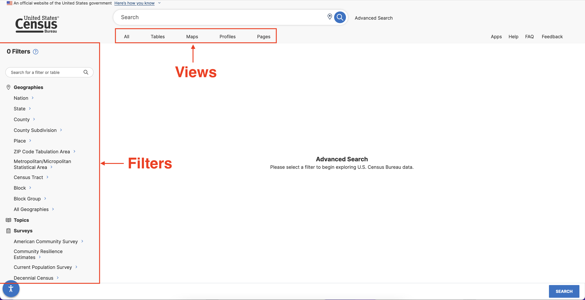

## 2.2 Filter by Geography

Let's say that we're interested in data for counties in California. We can filter this by looking under the `Geographies` section of the sidebar and selecting the `County` option. This expands an additional sidebar with a list of all possible states and territories where county-level data are available. We'll select `California`.

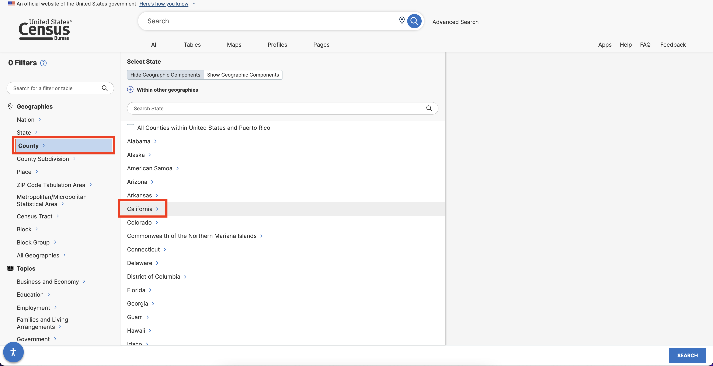

This brings us to a new list, with the names of every county in California. For this example, we'll select `All Counties within California`. When we do this, a box with the name of that filter will appear in the top left corner of the window. This keeps track of our **Active Filters.**

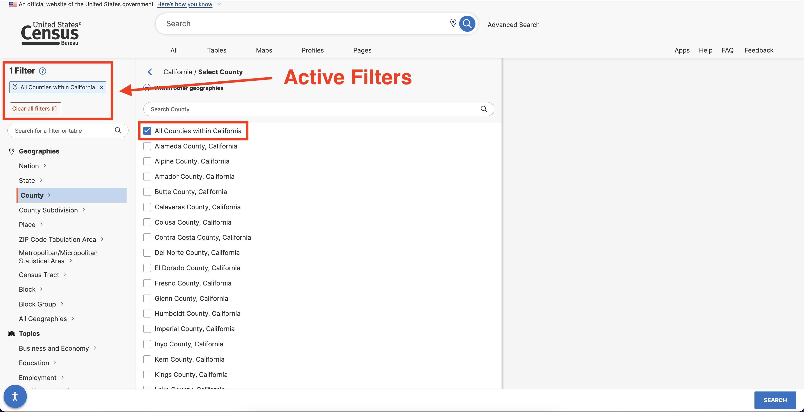

## 2.3 Summary Tables

Next, we select the `Tables` button from the view options at the top of the window, and we are shown a list of tables with data that we can look at. Each of these tables includes a code in **bold text** (`P1`, `PEPANNRES`, `DP05`, etc.), and a name describing the type of data contained in the table.

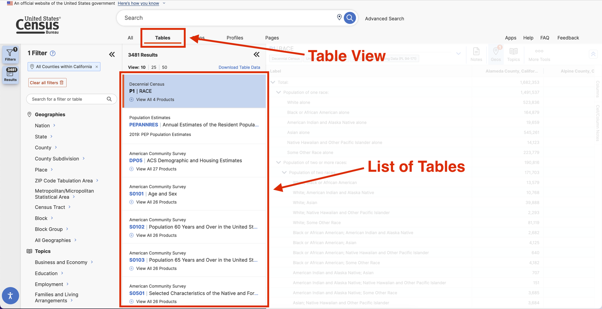

The first table in the list automatically shows up in our table view. The name of the table `P1 | RACE` appears in the top left corner. The first column of the table provides us with the name of each variable. The first row shows us the `Total`, in this case representing the total population. If we look at the second column, we can see that the total population of Alameda County was 1,682,353.

Note that the `Total` label has a small downward arrow to its left. This means that all of the rows below that arrow are contained within the total population. If you try clicking one of those arrows, all of the rows beneath that arrow will be hidden; click the arrow again to reveal those rows.

If we look at the next row, we see a summary of `Population of one race`, which was 1,491,537 for Alameda County. This label also has a downward arrow, slightly more indented than the first. This means that the next six rows (everything between this row and the next downward arrow) are all contained within the `Population of one race` category. Clicking that arrow will only hide/reveal those six rows.

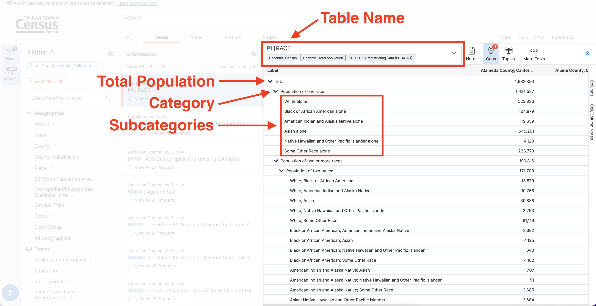

💡 **Tip**: The above table shows us population counts for **Race**. However, the U.S. Census separates the concepts of "**race**" and "**ethnicity**" into two separate variables:

-   **Race** consists of six categories: `White`, `Black or African American`, `American Indian or Alaska Native`, `Asian`, `Native Hawaiian or Pacific Islander`, and `Other`. There is also a *de facto* seventh category for individuals that report `Two or more races`.

-   **Ethnicity** refers to whether someone identifies as `Hispanic or Latino`. Each individual must identify with a particular race *and* a particular ethnicity, so someone could be `Non-Hispanic White`, `Hispanic White`, `Non-Hispanic Black or African American`, `Hispanic Black or African American`, and so on.

-   Oftentimes, researchers looking at race and ethnicity will treat all individuals identifying as `Hispanic or Latino` as a separate category, with all other race categories representing only "non-Hispanic" members of that group (`Non-Hispanic White`, `Non-Hispanic Black or African American`, etc.).

This table view also provides other useful information about the data we're looking at. The small grey boxes under the table name tell us this table's data source, "universe", and "vintage". Let's explore what these mean:

-   **Data Source**: The census data product used to create this summary table. This includes the Decennial Census and the American Community Survey.

-   **Universe**: The overall "population" represented by this summary table. In this case, the table represents the "Total population" of the United States.

    -   ⚠️ **Warning**: The universe will [not]{.ul} always be total population! The universe for a table about housing will usually be **"housing units"** or **"households"**, and the universe for a table about employment will most likely be the **"working-age population"**. Pay attention to the universe represented by each summary table!

-   **Vintage**: The year and specific data product used to create this summary. The decennial census is a broad source of data, but there are many different vintages of the decennial census. In this example, we are specifically looking at **Redistricting Data** from the **2020 Decennial Census**.

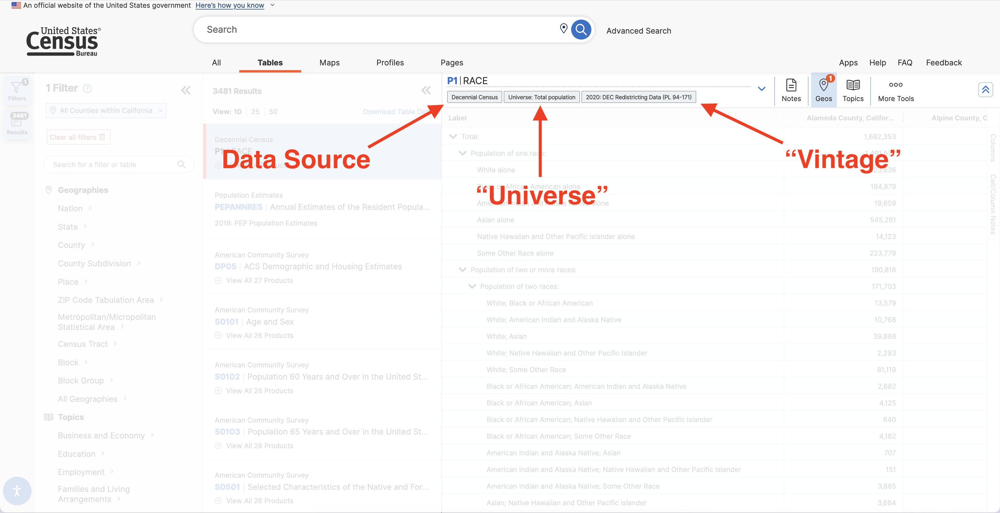

## 2.4 Filter by Survey

Let's add some additional filters! For this example, we'll look specifically at the American Community Survey 5-Year Estimates, which are often used because they produce more reliable estimates. As mentioned previously, the downside of 5-Year Estimates is that these data are averaged over multiple years, which means that they are less sensitive to changes over time.

To select American Community Survey 5-Year Estimates, we scroll down the filters sidebar to the `Surveys` section, select `American Community Survey` and then select `5-Year Estimates`.

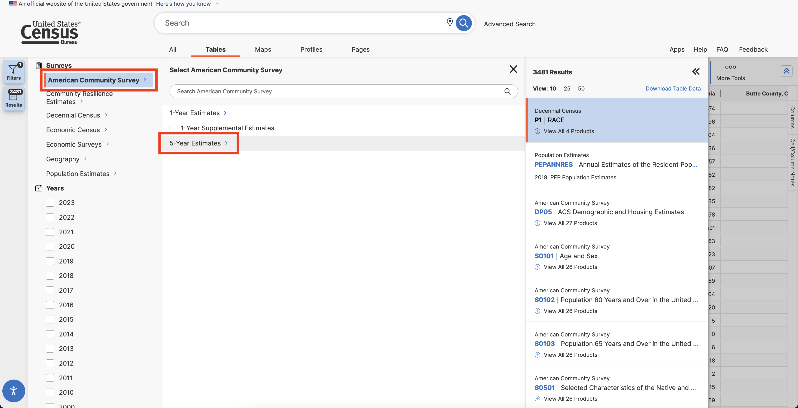

On the new selection window, we have various types of summary tables available to us. These summary types provide us the information in slightly different formats, and the one we need will depend upon which variable we're looking at. Generally speaking, the three most useful summary types are `Data Profiles`, `Subject Tables`, and `Detailed Tables`.

-   `Data Profiles` provide broad summaries of variables related to a given area of interest (social, economic, housing, and demographic characteristics). These tables may include estimated counts, along with percentages and summary statistics such as mean and median.

-   `Subject Tables` provide summaries of variables related to a more specific subject area, such as summarizing various characteristics of the population 65 and over, or summarizing commuting characteristics by various demographic characteristics. These tables may include estimated counts, along with percentages and summary statistics such as mean and median.

-   `Detailed Tables` provide the most specific summaries, usually about a single specific subject (e.g. **income**, **race**) or crosstab (e.g. **sex** by **age**, **race** by **ethnicity**).

For this example, we're going to look at `Detailed Tables`, which are often the most useful for analysis because they already contain the most detailed estimates.

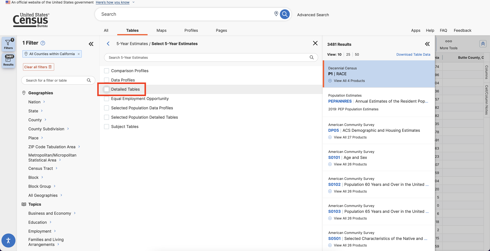

Selecting these options provides us with a new table preview, this time for table `B01001 | Sex by Age`. This table summarizes the total estimated number of people of each sex by each age group. Unlike the previous table, this summary table also includes two columns for each county: `Estimate`, and `Margin of Error`. As mentioned previously, the American Community Survey is only a survey of the population, which means that it only produces *estimates* of the population.

The `Margin of Error` column accounts for the range of likely values around the official estimate. Rows with `*****` have an effective margin of zero, while rows with a specific numeric value have a range of possible values. For example, the **total male population in Alameda County between 5 and 9 years old** is 47,576 ± 1,209, which means that the actual population of that group is most likely between 46,367 and 48,785.

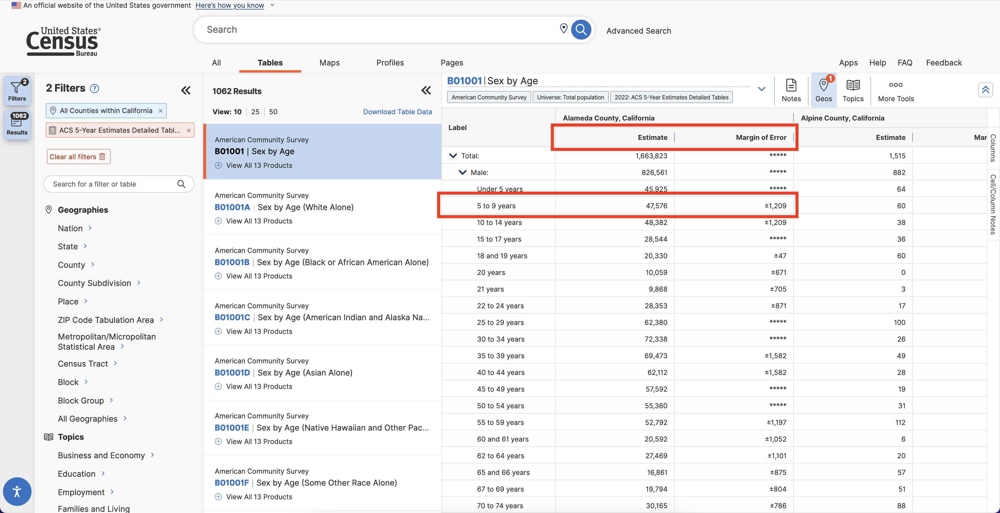

This table view is currently showing us the most recent American Community Survey 5-Year Estimates, which are from 2022. Since these estimates are based on averages over 5 years, this means that we are actually looking at the average estimated population between 2018 and 2022. If we click on the name of the table, it will provide us with a dropdown that shows us all of the other **vintages** for this table. In this case, these vintages include every year going back to 2010.

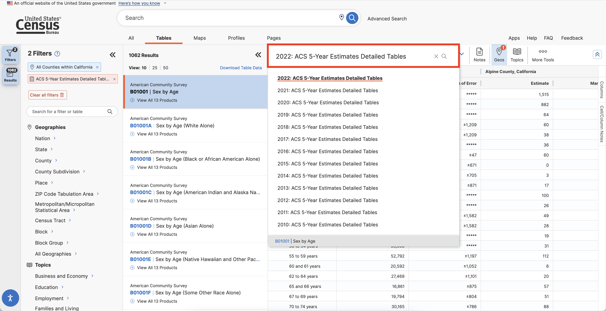

## 2.5 Filter by Topic

Let's say that we are specifically interested in economic questions, so we want to look at annual incomes. If we scroll down the sidebar, there is an option for `Income and Poverty` under `Topics`. Under the list of options, let's check the box for `Income and Poverty`.

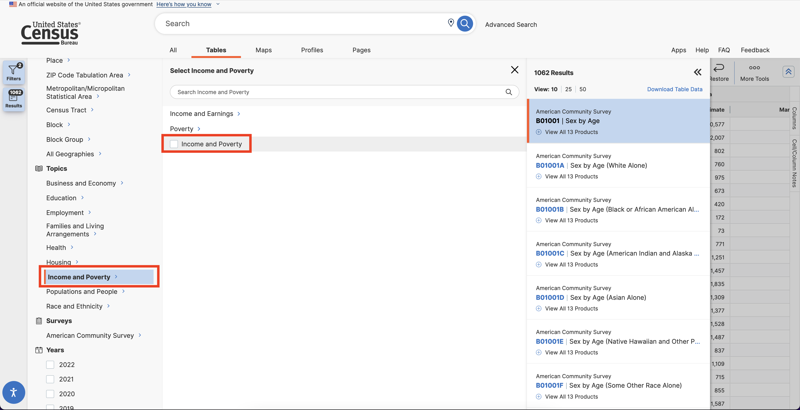

This provides us with yet another set of new tables! Also note that we now have three active filters: `All Counties within California`, `ACS 5-Year Estimates Detailed Tables`, and `Income and Poverty`. However, the list of tables that we are getting here is pretty confusing. The very first table is `B05010 | Ratio of Income to Poverty Level in the Past 12 Months by Nativity of Children Under 18 Years in Families and Subfamilies by Living Arrangements and Nativity of Parents`. What does any of that mean??

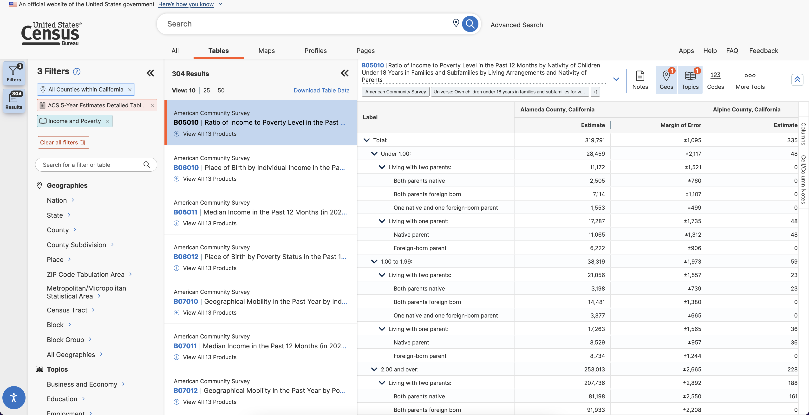

This is because the tables are *not* arranged in order of usefulness. Instead, they are arranged in order by table name! Table `B05010` is the first table in the `Income and Poverty` category, followed by `B06010`, etc. It turns out that we have to go all the way to the **bottom of the eighth page of table results** before we find what we're looking for: `B19001 | Household Income in the Past 12 Months (in 2022 Inflation-Adjusted Dollars`, which gives us the total number of households in different income categories. That's a lot of extra searching just to find this table!

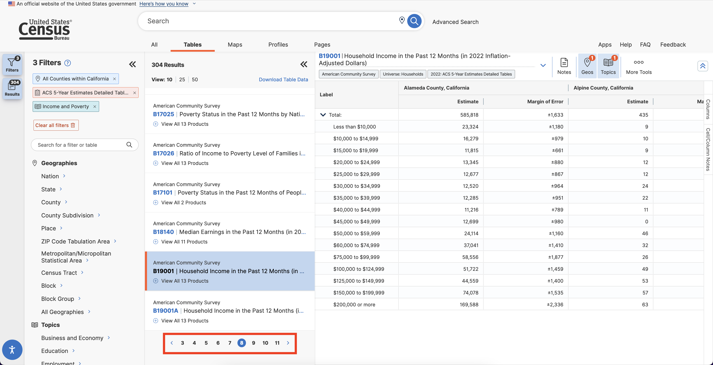

## 2.6 Data Download

Once we find the table we're looking for, we can download the table by clicking the `More Tools` button in the top right corner of the window, and selecting either `Excel`, `CSV`, or `ZIP`. The first two options give us a spreadsheet that looks pretty much identical to the table views on the web interface, with a row for each variable and two columns (`Estimate` and `Margin of Error`) for each county. The `ZIP` option downloads a folder with multiple files, and provides the data in a **flipped** format where each row represents a [county]{.ul}, and each set of two columns (`Estimate` and `Margin of Error`) represents a [variable]{.ul}.

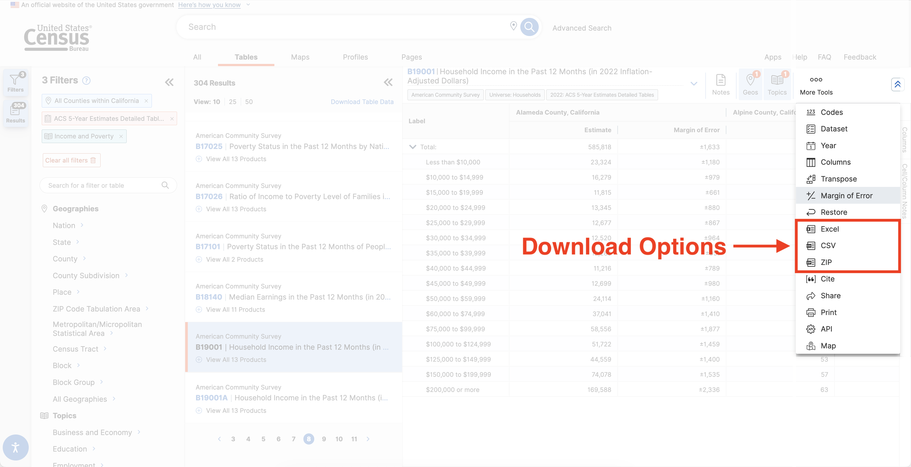

And that's how we find and download census data with [data.census.gov](data.census.gov)! However, this method is pretty clunky. It requires adding a lot of filters, and it requires you to have a pretty good understanding of exactly what you're looking for. For a long time, this type of web-based interface has been the primary way to explore census data. However, we now have a much better tool at our disposal!

# Part 3: [tidycensus](https://walker-data.com/tidycensus/)

In this tutorial, we will work through several exercises using the [tidycensus](https://walker-data.com/tidycensus/index.html) R package to fetch, wrangle, and map census data.

This R package was developed by [Kyle Walker](https://walkerke.github.io/) to make it easier to fetch data from the **Census API** (we'll explain that more in a second!).

The key `tidycensus` functions we will use today are:

-   `census_api_key()`: makes your Census API key available to tidycensus

-   `load_variables()`: retrieves a dataframe of available census data variables

-   `get_decennial()`: fetches census data from a recent decennial censuses (2000, 2010, and 2020)

-   `get_acs()`: fetches census data from American Community Survey 1-year estimates (beginning with 2005) or 5-year estimates (beginning with 2009)

## 3.1 Installing Packages

Let's start by installing the packages we'll need! If there are any of these packages that you haven't installed yet.

```{r}
## Install and load package management package
install.packages("pacman")
library(pacman)

## Load and/or install necessary packages
p_load(tidyverse,  ## Data wrangling
       sf,         ## Spatial data
       tidycensus, ## Downloading census data
       tigris,     ## Downloading census geographies
       mapview)    ## Interactive mapping
```

## 3.2 Getting a Census API Key

You need a `Census API key` to programmatically fetch census data.

-   Get it here: <https://api.census.gov/data/key_signup.html>

-   The key will be sent to your email and you will need to click to activate it.

*For more info on all available Census APIs see: <https://www.census.gov/data/developers/data-sets.html>*

**To use your Census API Key in R:**

1.  Copy and paste your Census API key from your email either:

    -   Directly into the R Script (see below)
    -   Into a separate text file

2.  Use the tidycensus function `census_api_key()` to register your API key with `tidycensus`.

```{r, eval=FALSE}

# Option 1: Copy your key directly into the R Script (with quotes around it!)
census_api_key("THE_BIG_LONG_ALPHANUMERIC_API_KEY_YOU_GOT_FROM_CENSUS")

# Option 2: Read from text file
census_api_key(read_lines("census.txt"))
```

## 3.3 Finding Variables with `load_variables`

For any census dataset, we can use the tidycensus `load_variables` function to fetch all available variables.

This function requires two primary arguments: the `year` of the data, and the `dataset`.

Dataset Options:

-   `sf1`: Decennial Census Summary File 1, featuring total population counts and basic summaries

-   `sf3`: Decennial Census Summary File 3, featuring estimates from decennial samples **(year 2000 only)**

-   `acs1`, `acs1/profile`, `acs1/subject`: 1-Year ACS Estimates, grouped into three categories:

    -   `acs1`: "detailed" tables

    -   `acs1/profile`: "profile" tables that give overviews of key statistics on topics like economic and housing characteristics

    -   `acs1/subject` "subject" tables that focus on specific areas of interest

-   `acs5`, `acs5/profile`, `acs5/subject`: 5-year ACS Estimates, grouped into those same three categories

💡 **Tip**: As a general rule, the "detailed" tables represented by `acs1` and `acs5` are the default for seeking specific variables. The `profile` and `subject` tables may have useful additional variables, including the *percentage* of the population within particular groups.

```{r}
## Load 2010 Decennial Variables (SF1)
vars2010 <- load_variables(year = 2010, dataset = "sf1")

## Let's use the `View` function to look at the full table
View(vars2010)
```

This table features three columns:

-   `name`: The internal census code for each variable. This is what we'll ultimately use to request variables from the census API!

-   `label`: The name of the variable. These names may use `!!` to separate the names of categories and subcategories (and even sub-subcategories), much like the dropdown arrows from the [data.census.gov](data.census.gov) interface.

-   `concept`: The table that the variable belongs to, which tells us the topic that the variable is referring to.

⚠️ **Warning**: Many variables have similar names (i.e. "Total"). Make sure to check both the `label` and `concept` columns to make sure you're choosing the right one!

## 3.4 Fetching Decennial Census Data with `get_decennial`

Let's start by looking at the very first variable in our table: total housing units! The name of this variable is `H001001`.

```{r}

## Download state-level decennial census variables
units2010 <- get_decennial(geography = "state",       ## Tabulation Unit
                           variables = "H001001",     ## Variable Name for Total Units
                           year = 2010)               ## Year

## View the output
View(units2010)
```

We successfully loaded the number of housing units by state! But this function lets us do a lot more. For example, we can pass [multiple]{.ul} variable names to the `variables` function argument at the same time. Below we add `H002002` for the number of housing units in **urban areas**.

💡 **Tip**: We can also use the `variables` argument to [rename]{.ul} our variables so that they are easier to interpret! In the code below, we'll change the name of `H001001` to "total", and the name of `H002002` to "urban".

```{r}

## Download state-level decennial census variables
units2010 <- get_decennial(geography = "state",              ## Tabulation Unit
                        variables = c("total" = "H001001",   ## Total Housing
                                      "urban" = "H002002"),  ## Urban Housing
                        year = 2010)                         ## Year

## View the output
View(units2010)
```

🔔 **Question**: What has changed from the previous version of this table? How is the table storing information for multiple variables?

The `get_decennial` function defaults to a **"long"** or **"tidy"** format, which means that we have a single column for all of the values, and another column that tells us the variable that each row is associated with. We can instead request a **"wide"** format, where each variable gets its own column!

```{r}

## Download state-level decennial census variables
units2010 <- get_decennial(geography = "state",                   ## Tabulation Unit
                             variables = c("total" = "H001001",   ## Total Housing
                                           "urban" = "H002002"),  ## Urban Housing
                             year = 2010,                         ## Year
                             output = "wide")                     ## "Wide" Format 

## View the output
View(units2010)
```

## 3.5 Visualizing Decennial Census Data

We can use the `ggplot2` package to create a horizontal bar chart.

💡 **Tip**: We will only be covering basic uses of `ggplot2` in today's workshop. D-Lab's [R Data Visualization](https://github.com/dlab-berkeley/R-Data-Visualization) workshop is highly recommended for additional information on how to create effective data visualizations in R!

```{r}
ggplot() +                        ## Initialize plot
  geom_col(data = units2010_wide, ## Add data
           aes(x = total,         ## Set x-axis as total housing
               y = NAME))         ## Set y-axis as state name
```

Let's clean up this chart, dividing the number of housing units by 1 million, and sorting the states by number of housing units!

```{r}
ggplot() + 
  geom_col(data = units2010_wide,
           aes(x = total/1000000, ## Units / 1 million
               y = reorder(NAME, total))) + ## Reorganize states by total housing units
  theme_bw() + 
  ggtitle("Housing Units by State (2010)") +
  xlab("Housing Units (in Millions)") +
  ylab("State")
```

Even with these adjustments, this chart is a bit difficult to read and interpret. What if we want to create a **map** of this data, instead? For this, we need to adjust our data download to include the argument `geometry`:

```{r}
## Download state-level decennial census variables
units2010 <- get_decennial(geography = "state",       ## Tabulation Unit
                           variables = c("total" = "H001001",
                                         "urban" = "H002002"),
                           year = 2010,               ## Year
                           geometry = TRUE,           ## Include Spatial Information
                           output = "wide")           ## "Wide" Format 

## View the output
head(units2010)
```

The `tidycensus` package downloads spatial data as an `sf` ("simple features") object. Note that this data format looks like an ordinary data frame, but has an additional `geometry` column containing a complex object. This column stores information about the shape of the geographic observation represented by each row.

💡 **Tip**: We will only be covering basic principles of geospatial data in R in today's workshop. D-Lab's [R Geospatial Fundamentals](https://github.com/dlab-berkeley/R-Geospatial-Fundamentals) workshop is highly recommended for additional information on how to work with spatial data in R!

Luckily, we can easily create a map of `sf` objects using the `ggplot2` package with the `geom_sf` function. This function does [not]{.ul} require `x` or `y` arguments, because these spatial data are already stored within the `geometry` column. Instead, we simply need to provide the `data` we wish to use, and the `fill` color:

```{r}
ggplot() + 
  geom_sf(data = units2010,
          aes(fill = total))
```

There's a big problem here! The data are showing up, but the continental U.S. is really tiny and squished onto the left-hand side of the map.

🔔 **Question**: Why do you think this is happening?

Luckily, there's a quick fix! We can add the argument `shift_geo`, which will fix the geographic anomalies that come with trying to accurately map out the entirety of the United States in space.

```{r}
## Download state-level decennial census variables
units2010 <- get_decennial(geography = "state",       ## Tabulation Unit
                           variables = c("total" = "H001001",
                                         "urban" = "H002002"),
                           year = 2010,               ## Year
                           geometry = TRUE,           ## Include Spatial Information
                           output = "wide",           ## "Wide" Format 
                           shift_geo = TRUE)          ## Fix Alaska/Hawaii problem

ggplot() + 
  geom_sf(data = units2010,
          aes(fill = total))
```

💡 **Tip**: Notice that adding this argument has not only moved around Alaska and Hawaii: it has also changed the shape of the entire map! The background grid of the original map was composed of straight lines, but now the grid lines are *curved*. This is because the `shift_geo` argument transforms the spatial data from a **geographic coordinate system** into a specific **projected coordinate system** called "Contiguous Albers Equal Area Conic". D-Lab's [R Geospatial Fundamentals](https://github.com/dlab-berkeley/R-Geospatial-Fundamentals) workshop provides much more information about how coordinate systems work and why they are important!

The map above isn't all that interesting -- we already know that California and Texas have large populations! We can combine multiple variables for greater insights. For example, **what share of housing units in each state are located in urban areas?**

```{r}
## Calculate share of housing units in urban areas
units2010 <- units2010 %>% 
  mutate(pct_urban = urban/total)

## Create new plot using `pct_urban`
ggplot() + 
  geom_sf(data = units2010,
          aes(fill = pct_urban))
```

🔔 **Question**: Do we notice any interesting patterns? Which states appear to be the most urban, and which states appear to be the most rural?

## 3.6 Census Tabulation Units

Census data is collected from individuals. The individual-level responses are called `microdata`.

The use of microdata is limited due to privacy concerns. Most census data are made publicly available only when aggregated to larger geographic `"tabulation units"`.

-   Some of these are real administrative units like states and counties.
-   Others are statistical units created by the census, like census tracts and block groups.

Tabulation units are generally **nested**: counties are nested within states, census tracts are nested within counties, etc. There are also other geographic scales that align with political or administrative geographies, including `Places` (cities, towns, and unincorporated areas), and `Congressional Districts`.

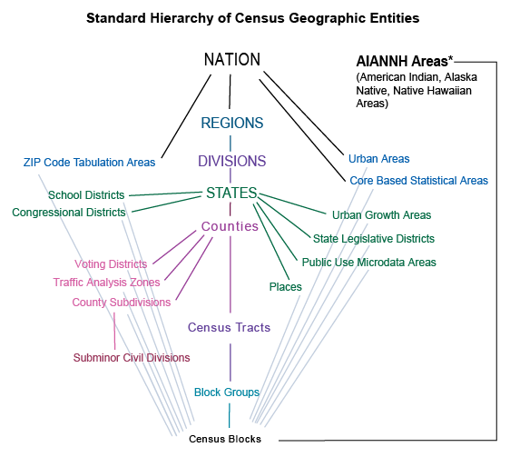

Some of the most common geographic tabulation units and their tidycensus function abbreviations are shown below, along with **required** and available filters that limit what data are returned.

Note that almost all geographic levels can be called by either `get_acs()` or `get_decennial()`. The exception are census blocks, which are extremely small geographies (generally approximately the size of a single city block) that are only available for the decennial census.

| Geography     | Definition           | Filter(s)             | Used in tidycensus             |
|---------------|----------------------|-----------------------|--------------------------------|
| "us"          | United States        |                       | `get_acs()`, `get_decennial()` |
| "region"      | Census region        |                       | `get_acs()`, `get_decennial()` |
| "state"       | State or equivalent  | state                 | `get_acs()`, `get_decennial()` |
| "county"      | County or equivalent | state, county         | `get_acs()`, `get_decennial()` |
| "place"       | Census place         | state                 | `get_acs()`, `get_decennial()` |
| "tract"       | Census tract         | **state**, county     | `get_acs()`, `get_decennial()` |
| "block group" | Census block group   | **state**, county     | `get_acs()`, `get_decennial()` |
| "block"       | Census block         | **state**, **county** | `get_decennial()` only         |

Let's take a look at the same query for county-level data! The table above tells us that we can include optional arguments for specific states or counties when we're looking at county-level data. Let's focus on counties in California, using a new `state` argument.

```{r}

## Download **county-level** decennial census variables for California
units2010 <- get_decennial(geography = "county",       ## Tabulation Unit
                           variables = c("total" = "H001001",   ## Total Units
                                         "urban" = "H002002"),  ## Urban Units
                           year = 2010,               ## Year
                           state = "CA",
                           geometry = TRUE,           ## Include Spatial Information
                           output = "wide")           ## "Wide" Format 

units2010 <- units2010 %>% 
  mutate(pct_urban = urban/total)

## View the output
View(units2010)
```

If we map out this object, we can see that we now have data for all California counties:

```{r}

ggplot() +
  geom_sf(data = units2010,
          aes(fill = pct_urban))

```

## 3.7 Fetching ACS data with `get_acs`

So far, we've focused on data from the decennial census. But those data are only released every 10 years, and the most recent census (2020) has data quality concerns due to the impacts of the Covid-19 pandemic. So let's look at the other census data product: the American Community Survey (ACS)!

As before, we can start by looking at the list of possible variables. We'll look at the most recent year of available data (`2022`), and we'll focus on the more stable 5-Year Estimates (`acs5`).

⚠️ **Warning**: Remember that ACS variables are spread across three separate groups: detailed tables (`acs5`), profile tables (`acs5/profile`), and subject tables (`acs5/subject`). You may want to explore all three to find the specific variable(s) you're looking for.

```{r}

vars2022 <- load_variables(year = 2022,
                           dataset = "acs5")

View(vars2022)
```

We've already spent some time looking at the share of housing units that are urban, so let's change our focus to something more interesting: median household income. If we search for "median household income" in the variable table, we can see a full list of variables that contain that term.

If we expand the "concept" column, we can see that the first several variables provide the median household income for specific race groups. If we look down far enough, we can see "Median Household Income in the Past 12 Months (in 2022 Inflation-Adjusted Dollars)" is represented by variable `B19013_001`. We'll use this one!

```{r}

## Download tract-level ACS census variables for Alameda County

mhi2022 <- get_acs(geography = "county",      ## Tabulation Unit
                     variables = "B19013_001",  ## Median Household Income
                     year = 2022,
                     state = "CA")           

View(mhi2022)
```

By default, the `get_acs()` function pulls 5-Year ACS estimates. But what if we want more up-to-date estimates? We can switch to 1-Year ACS estimates by setting the argument `survey` equal to `acs1` (the argument for 5-Year estimates is `acs5`).

```{r}

## Download tract-level ACS census variables for Alameda County

mhi2022 <- get_acs(geography = "county",      ## Tabulation Unit
                   variables = "B19013_001",  ## Median Household Income
                   year = 2022,
                   state = "CA",
                   survey = "acs1")           

View(mhi2022)
```

⚠️ **Warning**: Larger geographies such as **states**, **counties**, and **places** have both 1-Year and 5-Year estimates available. Smaller geographies including **tracts** and **block groups** only provide 5-Year estimates due to small sample sizes.

Let's create a graph of our data! This time, however, we will also include an additional function called `geom_errorbar` so that we can see the "margin of error" surrounding our estimates. This function takes the arguments `xmin` and `xmax` (or `ymin` and `ymax` if the graph is oriented vertically). The bottom of our margin (`xmin`) will be the `estimate` [minus]{.ul} the margin of error (`moe`), and the top of our margin (`xmax`) will be the `estimate` [plus]{.ul} the margin of error.

```{r}
ggplot(data = mhi2022) +
  geom_col(aes(x = estimate,
               y = reorder(NAME, estimate))) +
  geom_errorbar(aes(xmin = estimate - moe,
                    xmax = estimate + moe,
                    y = NAME))
```

This graph isn't super readable because there are so many counties! We can simplify things a bit by focusing on counties with an estimated median household income greater than \$100,000:

```{r}
ggplot(data = med_hhinc %>% filter(estimate > 100000)) +
  geom_col(aes(x = estimate,
               y = reorder(NAME, estimate))) +
  geom_errorbar(aes(xmin = estimate - moe,
                    xmax = estimate + moe,
                    y = NAME))
```

What if we're interested in the spatial distribution of median household incomes for individual neighborhoods? For this, we will use census tracts. Queries involving census tracts require you to specify a state, and include an optional argument for the county or counties you wish to look at. Let's look at Alameda County as an example:

```{r}

mhi2022 <- get_acs(geography = "tract",      ## Tabulation Unit
                   variables = c("medinc" = "B19013_001"),  ## Median Household Income
                   year = 2022,               ## Year
                   state = "CA",              ## State
                   county = "Alameda",        ## County
                   geometry = TRUE)           ## "Wide" Format 

View(mhi2022)
```

Now we can map out our data, using the `geom_sf()` function!

```{r}
ggplot() +
  geom_sf(data = medincE,
          aes(fill = estimate))
```

🔔 **Question**: What spatial patterns do you notice? Which neighborhoods seem to be particularly wealthy (or not)?

🎬 **Demo**: We can also create interactive maps of our data, using the `mapview` package!

```{r}
mapview(med_hhinc, zcol="estimate")
```

# Part 4: Challenges

Let's take what we've learned and use census data to answer a research question!

As we discussed at the beginning, there are many different types of research questions that census data can help us answer. Let's start with a simple descriptive question that we can easily investigate: What are the cheapest and most expensive places for renters in Alameda County?

💡 **Tip**: The best way to summarize rental housing costs is "median gross rent", which refers to the median housing cost for renters (including both the rent they directly pay to the landlord and the cost of utilities).

Let's take this one step at a time, following the approach we took previously:

1.  First, we need to find the variable we're looking for, using the `load_variables` function
2.  Second, we input that variable into either `get_decennial` or `get_acs` to get our data
3.  Third, we can visualize and/or map the resulting data

```{r}

## Step 1: Find variable(s)
vars <- load_variables(year = ____,
                           dataset = "___")

View(vars)

## Step 2: Load data
df <- get_acs(geography = "_____",
              variables = c("_________" = "__________"),
              year = ____,
              state = "__",
              county = "_______",
              output = "____"
              geometry = ____)

## Step 3: Visualize data
ggplot() + 
  geom_sf(data = rent,
          aes(fill = estimate))
```

What are some other factors that we think might be associated with higher rents? Find a census variable and create a new dataframe with that variable.

```{r}

## Step 1: Find variables
View(vars)

## Step 2: Load data
df <- get_acs(geography = "_____",       ## [County or Tract]
                 variables = c("______" = "__________",
                               "______" = "__________"),  ## Median Household Income
                 year = ____,               ## Year
                 state = "__",              ## State
                 county = "_______",              ## State
                 output = "____",           ## "Wide" Format 
                 geometry = ____)           

## Step 3: Visualize data
ggplot() +
  geom_point(data = df,
             aes(x = _______,
                 y = _______))

```

How have rents changed over time? We can figure this out by changing the year of our API query and assigning the result to a new object.

```{r}

df2 <- get_acs(geography = "_____",       ## [County or Tract]
               variables = c("______" = "__________",
                             "______" = "__________"),  ## Median Household Income
               year = ____,               ## Year
               state = "__",              ## State
               county = "_______",              ## State
               output = "____",           ## "Wide" Format 
               geometry = ____)           

```

# Possible Extensions

🎬 **Demo**: Census data for survey weighting

🎬 **Demo**: PUMS
